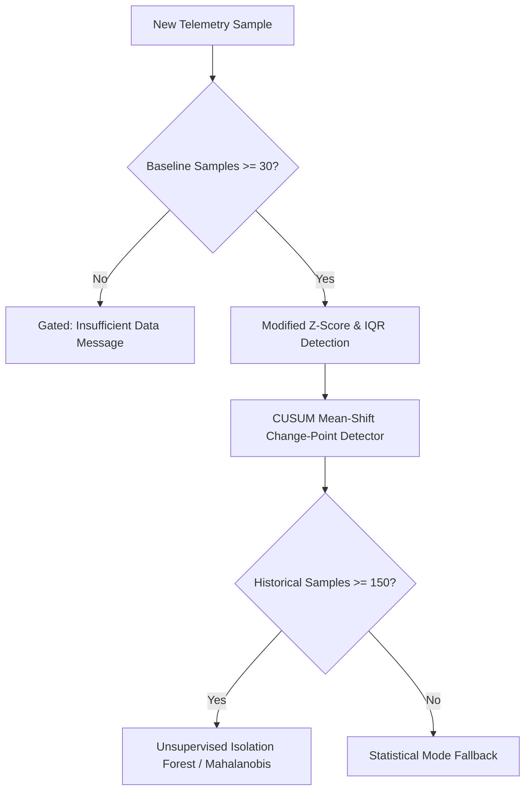

# NetIntel Anomaly Detection Engine

This document describes the algorithms, mathematical foundations, and mode switching implemented for anomaly detection.

---

## 1. Multi-Tiered Architecture

---

## 2. Statistical Detection Methods

### 1. Modified Z-Score
To guard against distortion from prior outliers, the Z-score is computed against the rolling median and standard deviation:
$$Z = \frac{|x_t - \mu_{\text{baseline}}|}{\sigma_{\text{baseline}}}$$
- $Z \ge 2.5 \implies \text{MEDIUM Anomaly}$
- $Z \ge 3.5 \implies \text{HIGH Anomaly}$
- $Z \ge 4.5 \implies \text{CRITICAL Anomaly}$

### 2. Interquartile Range (Tukey's Fence)
Non-parametric fence detection:
$$\text{IQR} = Q_3 - Q_1$$
$$\text{Upper Bound} = Q_3 + 1.5 \times \text{IQR}$$
$$\text{Lower Bound} = \max(0, Q_1 - 1.5 \times \text{IQR})$$
Any sample exceeding Tukey's fence is flagged with the exact numerical upper fence cited in evidence.

### 3. Change-Point Detection (Sliding Two-Window Mean Shift)
Divides the recent sample buffer into two equal windows ($W_1$ and $W_2$). Computes pooled standard error and tests for statistically significant step transitions:
$$t_{\text{shift}} = \frac{\bar{W_2} - \bar{W_1}}{\sqrt{\frac{s_1^2 + s_2^2}{2}}}$$
Detects abrupt structural jumps (e.g. route flaps, sudden ISP throttling) rather than transient spikes.

---

## 3. Machine Learning Mode Gating & Academic Honesty

1. **Strict Sample Gating:** The unsupervised Isolation Forest model requires at least 150 empirical historical samples before training is allowed.
2. **Transparent Mode Indication:** The system explicitly reports:
   - `Statistical Mode`: When sample history is accumulating (< 150 samples).
   - `ML Mode`: When the multi-variate model has been trained on real data.
3. **Zero Fake Metrics:** The system never fabricates synthetic training sets to claim fictional "99.9% ML accuracy".
