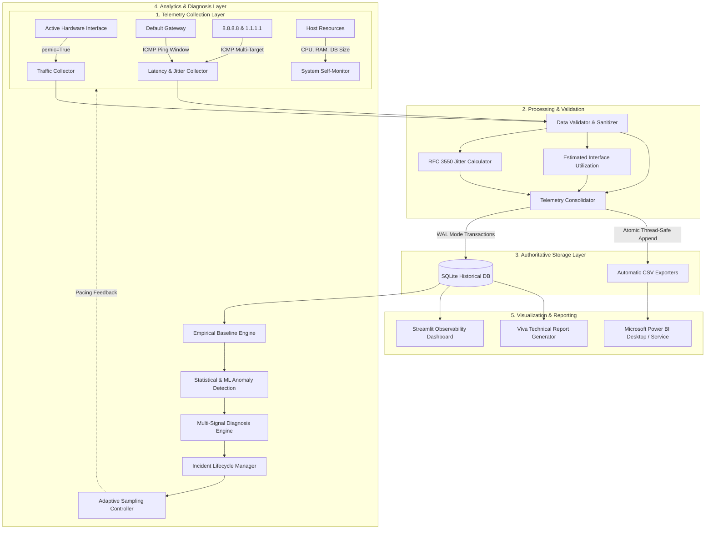
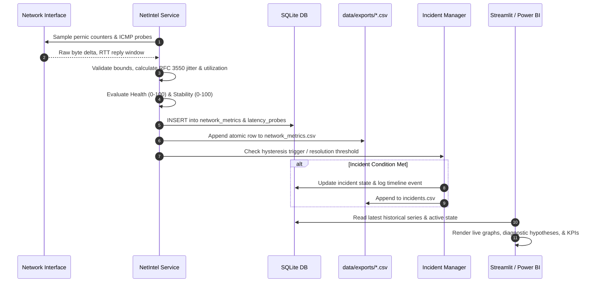
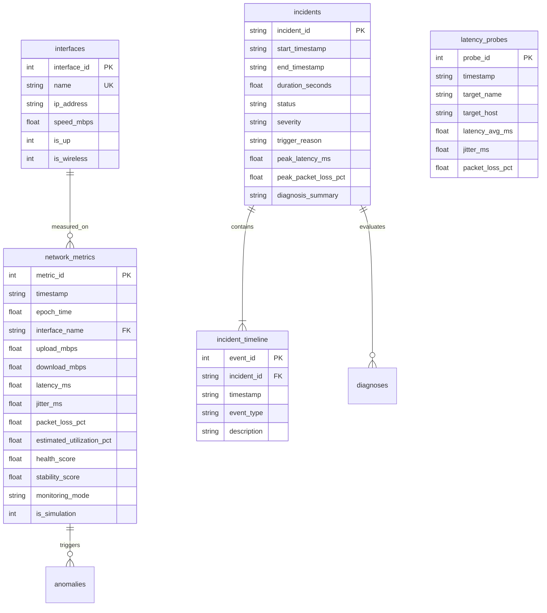

# NetIntel Architecture Specification

This document provides complete architectural specifications, system diagrams, and data pipeline flows for the **Real-Time Network Intelligence, Performance Diagnosis & Adaptive Optimization Platform (NetIntel)**.

---

## 1. High-Level System Architecture

---

## 2. Telemetry Pipeline Sequence

---

## 3. Database Entity-Relationship (ER) Diagram

